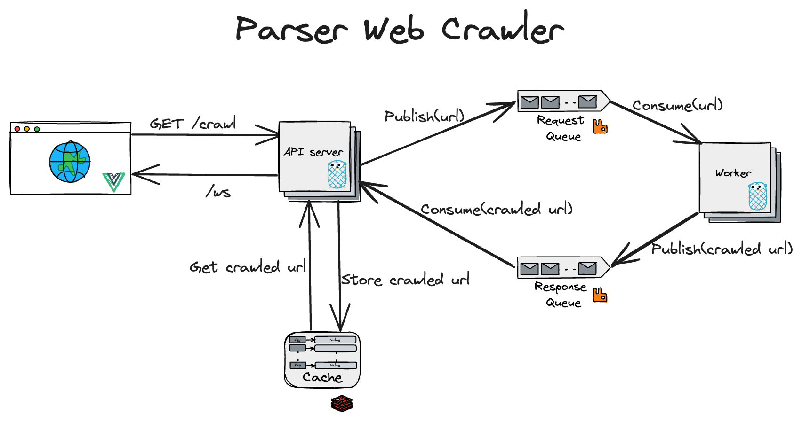

# Parser Web Crawler

## System Design

The designed proposed for the crawler consists of:  
- A Vue client: Allows users to enter a url for a website to crawl, and see the results of the crawling process. 
- A set of Go API servers: Gets the url to crawl, searches for it in the Redis cache and return it (with a 200 code). If it misses the cache, publishes the url in the RabbitMQ request queue to process (and returns a 202 code). After processing is done, it reads the results from the response queue, store it in the cache and send it back to the frontend using WebSockets. 
- A set of Go workers: Gets the url to crawl from the request queue and process it (perform the actual crawling), and sends the results to the response queue.





## Requirements:

### Docker
Download and install Docker.
If you are on a Mac (see https://docs.docker.com/docker-for-mac/install).
If you are on Ubuntu (https://docs.docker.com/install/linux/docker-ce/ubuntu/).

## Running the development environment

The local development environment consists of 5 docker containers:
- `redis`: the cache service.
- `rabbitmq`: the message broker service.
- `srv`: Go http server. Handles the API requests.
- `worker`: Go worker. Handles the web crawling.
- `vue`: Vue.js frontend application.

#### Running the application
The recommended way to start all the services together is executing `docker-compose up` in the root project folder.

Please wait until all services are fully up, it may take a while especially for the rabbitmq container.

- Access the front-end site with the following URLs: `http://localhost:3000`.
- Enter the url of the website you want to crawl and wait for the results from the websocket connection. 

#### Running Separately

To run the `srv` or `bot` services locally (outside of docker)

Stop the container
```
docker stop parsercrawler-srv-1 (or parsercrawler-worker-1)
```

Change the env variables specified in the `.env` file:
```
REDIS_HOST=localhost:6379
RABBITMQ_HOST=localhost:5672
```

Run the local server (you should have Go 1.20 installed):
```
cd server (or cd worker)
go run main.go
```

To run the `vue` client service locally (outside of docker), stop the container and run (you should have Node.js v.16.17):
```
docker stop parsercrawler-vue-1
cd client
npm install
npm run dev
```

#### Stopping the application
To stop all the services execute `docker-compose down` in the root project folder.


#### Running the test suite
To run the test suite execute:
```
cd server (or cd worker)
go test ./...
```